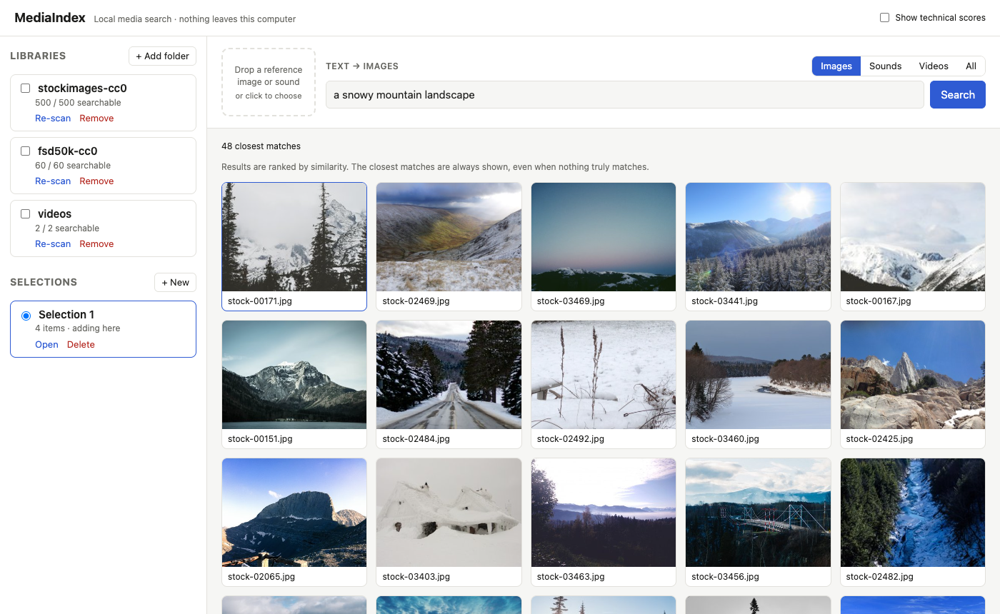
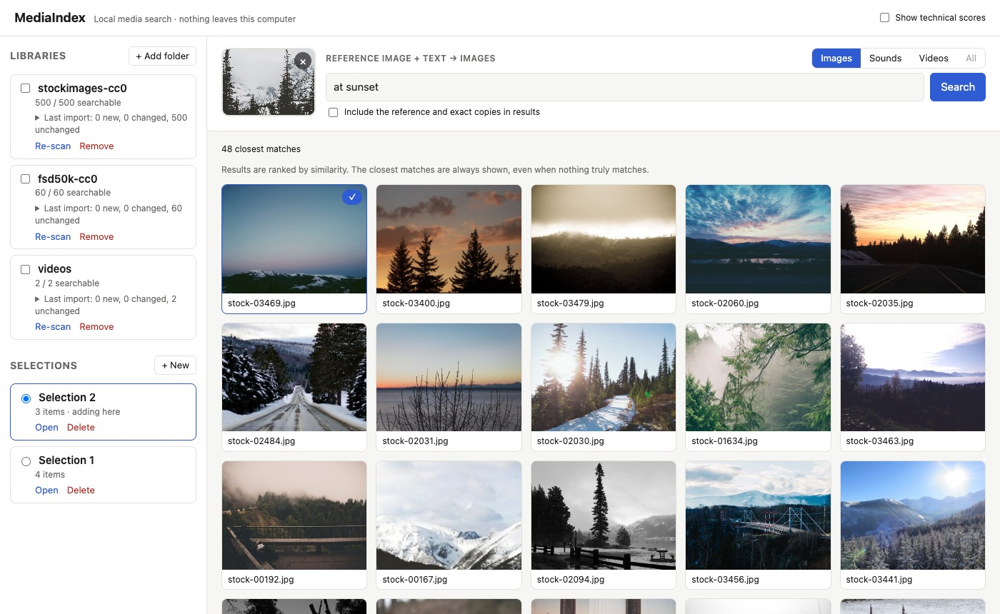
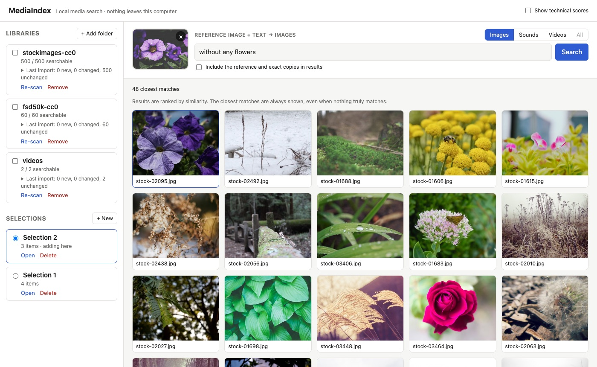
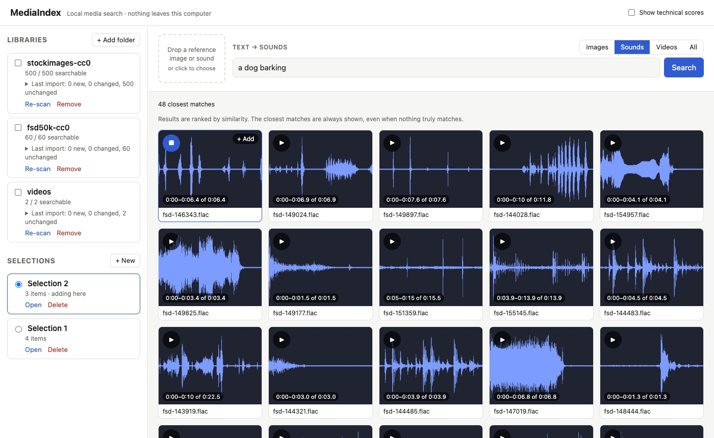
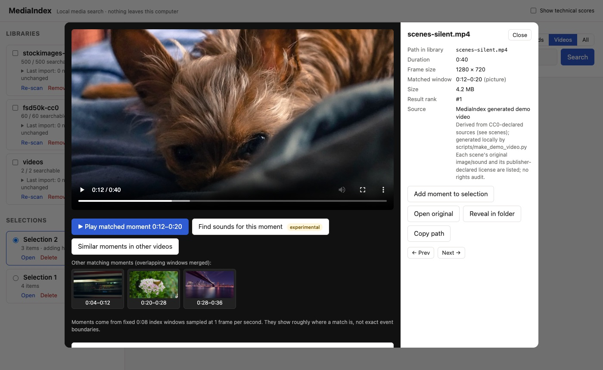

# MediaIndex

**Local media search for creators.** Point MediaIndex at your folders of images, sounds and MP4 videos, then search them by
describing what you want, by example, or by example plus text. You can preview results, collect selections, and export copies, clips and manifests.
Everything runs on your computer. There is no cloud account, nothing is uploaded, and there is no telemetry.

Embeddings come from [google/embeddinggemma-2](https://huggingface.co/google/embeddinggemma-2), one model for text, images, audio and video,
running locally. MediaIndex is an independent project. It is not a fork of Oxford's WISE.

> **Status:** Version 1 (image search) plus audio, cross-media and video-moment search. Verification evidence for every phase is in
> [`docs/progress.md`](docs/progress.md). Retrieval-quality metrics are **pending human relevance labels** (see [Evaluation](#evaluation)).



## Quick start (macOS on Apple silicon; Linux expected to work but untested)

Requirements: Python 3.12 with [uv](https://docs.astral.sh/uv/), Node 20+ (to build the UI once), and FFmpeg (`brew install ffmpeg`).
The first setup downloads about 1.5 GB of model weights.

```bash
git clone https://github.com/harsheetamorey/mediaindex.git && cd mediaindex
uv sync                                         # Python deps, pinned in uv.lock
(cd frontend && npm ci && npm run build)        # UI, served by the backend
mkdir -p data/samples/smoke                     # put 3+ of your own JPEGs here, then:
MEDIAINDEX_ALLOW_DOWNLOAD=1 uv run python scripts/model_smoke.py --images data/samples/smoke   # downloads + verifies the model
uv run python -m mediaindex                     # open http://127.0.0.1:8765
```

In the app, click **+ Add folder** and paste the folder's absolute path (in Finder, select the folder and press ⌥⌘C). Indexing runs in the
background with progress and cancel. You can search as soon as items are indexed.

### Optional demo data (traceable, publisher-declared CC0)
```bash
uv run --extra demo python scripts/download_demo.py         # 500 stock photos, ~115 MB  -> data/demo/stockimages-cc0
uv run --extra demo python scripts/download_demo_audio.py   # 60 CC0 FSD50K sounds, ~17 MB -> data/demo/fsd50k-cc0
uv run python scripts/make_demo_video.py                    # 40 s demo MP4 built from the two packs -> data/demo/videos
```
Each item keeps its source record. Publisher declarations are **not** a rights audit. See [`THIRD_PARTY_DATA.md`](THIRD_PARTY_DATA.md).

### Demo
`scripts/demo.sh reset`, then `scripts/demo.sh start` and, in a second terminal, `scripts/demo.sh setup`. This indexes the demo packs into a separate
`data/demo-app` state directory. The storyboard, the automatic walkthrough and the recording checklist are in [`docs/demo.md`](docs/demo.md).

| Image + text: "at sunset" | Honest miss: "without any flowers" |
|---|---|
|  |  |
| **Text → sounds: "a dog barking"** | **Text → video moment: "a dog"** |
|  |  |

## Offline use
After setup, `python -m mediaindex` forces offline model loading (`HF_HUB_OFFLINE=1` and `local_files_only`) and disables library telemetry.
Every media flow was verified with outbound networking blocked by a macOS sandbox, and a socket audit recorded zero outgoing connections
([`docs/offline-and-robustness.md`](docs/offline-and-robustness.md)). The server listens on `127.0.0.1` only.

## What you can search

| Query → results | Status |
|---|---|
| Text → images, sounds, video moments | verified |
| Image (upload or library item) → images | verified |
| Image + refinement text → images, video moments | verified; refinement is a soft steer, not a filter ([findings](docs/refinement-findings.md)) |
| Sound (upload or library window) → sounds | verified |
| Video moment → similar moments | verified |
| Image → sounds, sound → images, sound + text → sounds or images, moment → sounds | **experimental**: labelled in the UI ([findings](docs/cross-modal-findings.md)) |

Results are nearest neighbours by cosine similarity, so the closest items are **always** shown, even when nothing truly matches.
Scores are hidden by default and are never shown as percentages. Searching several media types at once groups results by type, because similarity
scales are not comparable across types.

**Supported formats:** JPEG, PNG and WebP images; WAV, FLAC and MP3 audio; MP4 video (H.264 tested). Audio is indexed in 10 s windows (5 s stride).
Video is indexed in 8 s windows (4 s stride) of frames sampled at 1 frame/s plus the window's soundtrack. Timestamps are only as precise as these windows.

**Creator outputs:** persistent ordered selections, a JSON manifest (source paths, hashes, source and licence records, how each item was found),
copy export with preview and confirmation (never overwrites, never touches originals), and video clip export (frame-accurate re-encode or fast keyframe copy)
with a provenance file ([`docs/clip-export.md`](docs/clip-export.md)).

## Hardware observations (Apple M1, 8 GB, MPS, bfloat16)
| | Observed |
|---|---|
| Model load (new process) | about 13 s |
| Text query embedding (warm) | about 39 ms median |
| Image reference upload / image+text query | about 1.8 s / 1.9 s |
| Ranking (exact) | 0.1 ms for 600 vectors; 22 ms for 200k synthetic vectors |
| Indexing | about 1.8 s per image, about 2 s per short sound, about 13 s per 8 s video window |
| Memory | about 3.5 GB peak physical footprint (model in unified memory) |

Precision follows the model card: bfloat16 on MPS, float32 on CPU, **never float16**. Override with `MEDIAINDEX_DEVICE=cpu|mps` and
`MEDIAINDEX_PRECISION=float32|bfloat16`. Full numbers: [`docs/evaluation-report.md`](docs/evaluation-report.md).

## Evaluation
A frozen 50-query image evaluation (20 text, 15 image, 15 image+text) with a local human-labelling page lives in `evaluation/`
([`docs/evaluation.md`](docs/evaluation.md)). **No relevance metrics are reported yet**, because the labels must come from a person. On the Clotho
text→audio benchmark, EmbeddingGemma 2 scores well below the specialist LAION-CLAP model: R@10 is 0.18 vs 0.50, and CLAP may benefit from training overlap
([`docs/model-comparison.md`](docs/model-comparison.md)).

## Troubleshooting
| Symptom | Fix |
|---|---|
| "model could not be loaded" | Run the model-download step once with `MEDIAINDEX_ALLOW_DOWNLOAD=1` (it needs network). |
| "another MediaIndex process is already using …" | Only one server per data directory. Stop the other one. |
| 503 "model is busy" | A long indexing step holds the model. Retry, or raise `MEDIAINDEX_QUERY_WAIT` (seconds, default 30). |
| Sounds or videos fail to import | Install FFmpeg 6+ and make sure `ffmpeg` and `ffprobe` are on PATH. Only MP4 video is accepted. |
| Search says "different model profile" (409) | The library was indexed with other model settings. Click **Re-scan** to reindex. |
| Port 8765 in use | `MEDIAINDEX_PORT=8800 uv run python -m mediaindex`. The UI is served from the same port. |
| Out-of-memory on 8 GB | Close other heavy apps, or run on CPU with `MEDIAINDEX_DEVICE=cpu` (slower). |

## Limitations
- Text→sound search is a rough candidate finder. On Clotho it scores far below a specialist audio model (see Evaluation).
- Retrieval quality is uneven. See the documented misses (glass and door sounds, sound→image "hub" images, ignored style refinements, no negation).
- Text refinement and cross-media results are similarity candidates. They are not logical filters, synchronized audio, or artistic judgements.
- Indexing is slow on an 8 GB M1, and video indexing runs at about 1.6× real time.
- Only tested on macOS 14 with Apple M1. Linux and Windows are untested (the reveal-in-folder command has untested Linux and Windows variants).
- Folders are added by pasting a path, because browsers cannot hand folder paths to local servers.

## Documentation
[Architecture](docs/architecture.md) · [Environment](docs/environment.md) · [Model compatibility](docs/model-compatibility.md) ·
[Progress & gates](docs/progress.md) · [Offline & robustness](docs/offline-and-robustness.md) · [Evaluation](docs/evaluation.md) ·
[Release checklist](docs/release-checklist.md) · [Demo](docs/demo.md) · [Release draft & handoff](docs/release-draft.md) ·
[Model comparison](docs/model-comparison.md) · [Contributing](CONTRIBUTING.md)

## Licence
Original code: Apache-2.0 ([`LICENSE`](LICENSE)). The model, third-party software and data have their own terms: [`NOTICE.md`](NOTICE.md) and
[`THIRD_PARTY_DATA.md`](THIRD_PARTY_DATA.md).
